# OpenSpec CLI Reference

Detailed reference for CLI commands, schema management, configuration, and
troubleshooting. The main `SKILL.md` covers the guided workflow -- this file
is for when you need specifics.

---

## CLI Commands Quick Reference

The full set of CLI commands is: `init`, `update`, `list`, `view`, `change`,
`archive`, `spec`, `config`, `schema`, `validate`, `show`, `feedback`,
`completion`, `status`, `instructions`, `templates`, `schemas`, `new`, `help`.

There is **no** `complete`, `done`, `mark`, or `finish` command. Artifact
completion is automatic -- the CLI detects that an artifact is `done` when its
output file exists at the expected path. Just write the file; `openspec status`
will reflect the updated state.

### Browsing

```bash
openspec list                       # List active changes
openspec list --specs               # List specs
openspec list --json                # JSON output for parsing

openspec show <name>                # Show change details
openspec show <name> --type spec    # Show a specific spec
openspec show <name> --json         # JSON output
openspec show <name> --deltas-only --json  # Delta specs only
```

### Status and Instructions

```bash
openspec status --change "<name>" --json
```

Returns:
- `applyRequires` -- artifact IDs needed before implementation
- `artifacts` -- list with `id`, `status` (`done`, `ready`, `blocked`),
  `missingDeps`
- `changeRoot`, `planningHome`, `artifactPaths`, `actionContext` -- path context

```bash
openspec instructions <artifact-id> --change "<name>" --json
```

Returns:
- `template` -- structure for the output file
- `instruction` -- schema-specific guidance
- `context` -- project background (constraints, not content for the file)
- `rules` -- per-artifact rules (constraints, not content for the file)
- `resolvedOutputPath` -- where to write the artifact
- `dependencies` -- completed artifacts to read for context

Use `apply` as the artifact ID to get implementation instructions:
```bash
openspec instructions apply --change "<name>" --json
```

### Validation

```bash
openspec validate <name>                    # Validate a specific change
openspec validate --all                     # Validate everything
openspec validate --all --json              # JSON for CI/scripts
openspec validate --all --strict            # Strict mode
openspec validate --all --concurrency 12    # Parallel validation
```

### Lifecycle

```bash
openspec archive <name>                # Interactive archive
openspec archive <name> --yes          # Skip confirmation
openspec archive <name> --skip-specs   # Skip spec updates
```

Archive moves the change folder to `openspec/changes/archive/YYYY-MM-DD-<name>/`
and merges delta specs into `openspec/specs/`.

---

## Schema Management

Schemas define what artifacts exist and their dependencies.

### Available Schemas

```bash
openspec schemas                     # List available schemas
openspec schemas --json              # JSON output
openspec schema which --all          # Show resolution sources
```

Default schema: `spec-driven` (proposal -> specs -> design -> tasks).

### Schema Precedence

1. CLI flag (`--schema <name>`)
2. Change metadata (`.openspec.yaml` in change directory)
3. Project config (`openspec/config.yaml`)
4. Default (`spec-driven`)

### Custom Schemas

```bash
openspec schema init <name>                          # Create new schema
openspec schema init rapid --artifacts "proposal,tasks" --default
openspec schema fork spec-driven my-workflow         # Fork existing
openspec schema validate my-workflow                 # Validate structure
```

Schema files live in `openspec/schemas/<name>/`:

```
openspec/schemas/my-workflow/
  schema.yaml
  templates/
    proposal.md
    tasks.md
```

Example `schema.yaml`:

```yaml
name: research-first
artifacts:
  - id: research
    generates: research.md
    requires: []
  - id: proposal
    generates: proposal.md
    requires: [research]
  - id: tasks
    generates: tasks.md
    requires: [proposal]
```

---

## Project Configuration

Located at `openspec/config.yaml`:

```yaml
schema: spec-driven

context: |
  Tech stack: Java 21, Spring Boot 3.x, Gradle
  API conventions: RESTful, JSON responses
  Testing: JUnit 5, Mockito, integration tests
  Style: Checkstyle, Google Java format

rules:
  proposal:
    - Include rollback plan
    - Identify affected teams
  specs:
    - Use Given/When/Then format for scenarios
  design:
    - Include sequence diagrams for complex flows
```

### Config Fields

| Field | Type | Description |
|-------|------|-------------|
| `schema` | string | Default schema for new changes |
| `context` | string | Injected into all artifact instructions (max 50KB) |
| `rules` | object | Per-artifact rules, keyed by artifact ID |

Context is wrapped in `<project-context>` tags and prepended to every
artifact's instructions. Rules are wrapped in `<artifact-rules>` tags and
injected only for matching artifacts.

---

## Global Configuration

```bash
openspec config list                          # Show all settings
openspec config get telemetry.enabled         # Get a value
openspec config set telemetry.enabled false   # Set a value
openspec config path                          # Show config file location
openspec config edit                          # Open in $EDITOR
openspec config profile                       # Configure workflow profile
openspec config profile core                  # Quick preset: core workflows
```

### Profiles

- `core` -- propose, explore, apply, sync, archive
- `custom` -- select individual workflows

After changing profile, run `openspec update` in your project.

---

## Environment Variables

| Variable | Description |
|----------|-------------|
| `OPENSPEC_CONCURRENCY` | Default concurrency for bulk validation (default: 6) |
| `EDITOR` or `VISUAL` | Editor for `openspec config edit` |
| `NO_COLOR` | Disable color output when set |

---

## Troubleshooting

### "Unknown artifact ID in rules: X"

Check artifact IDs match your schema. Run `openspec schemas --json` to see
artifact IDs for each schema.

### Config not being applied

- Ensure file is at `openspec/config.yaml` (not `.yml`)
- Check YAML syntax
- Config changes take effect immediately (no restart needed)

### Context too large

Context is limited to 50KB. Summarize or link to external docs.

### CLI not found after install

If using nvm/fnm, ensure the Node version with openspec installed is active:

```bash
nvm use 20
which openspec
```

If installed with a different Node version, reinstall:

```bash
npm install -g @fission-ai/openspec@latest
```

### Validation errors

Run with `--strict` for detailed output:

```bash
openspec validate --all --strict --json
```

Common issues:
- Missing required sections in artifacts
- Broken dependency references
- Orphaned delta specs

---

## Updating OpenSpec

```bash
npm update -g @fission-ai/openspec
openspec update    # Regenerate config files in the current project
```

---

## Links

- GitHub: https://github.com/Fission-AI/OpenSpec
- Docs: https://openspec.dev
- npm: https://www.npmjs.com/package/@fission-ai/openspec

---

## Interaction Flow

```mermaid
sequenceDiagram
    participant U as User
    participant A as Agent
    participant CLI as openspec CLI

    rect rgba(127,127,127,0.1)
    Note over U,CLI: Prerequisites
    A->>CLI: node --version
    alt Node missing or < 20.19.0
        A->>U: AskQuestion: install via nvm / fnm / brew?
        U->>A: selects option
        A->>CLI: runs install command
        Note over A: STOP until resolved
    end
    A->>CLI: which openspec
    alt CLI missing
        A->>U: AskQuestion: install via npm / pnpm / yarn / bun?
        U->>A: selects option
        A->>CLI: runs install command
        Note over A: STOP until resolved
    end
    A->>CLI: ls openspec/
    alt openspec/ missing
        A->>CLI: openspec init --tools none --force
    end
    end

    rect rgba(127,127,127,0.1)
    Note over U,CLI: Branch Check
    A->>CLI: git branch --show-current
    A->>U: "You are on <branch>. Is this the right branch?"
    alt Wrong branch
        A->>U: AskQuestion: branch type? (feature / bugfix / hotfix)
        U->>A: type + Jira key + short description
        A->>CLI: git fetch origin
        A->>CLI: git checkout -b <type>/<JIRA-KEY>-<description> origin/<default>
    end
    end

    rect rgba(127,127,127,0.1)
    Note over U,CLI: Jira/Confluence Context (optional)
    A->>U: AskQuestion: pull in Jira stories / Confluence pages / skip?
    alt Jira
        U->>A: issue key(s) or "search current sprint"
        Note over A: read jira skill, call jira_get_issue / jira_search
        A->>U: summary of fetched stories
    end
    alt Confluence
        U->>A: page title/URL or search term
        Note over A: read confluence skill, call confluence_get_page / confluence_search
        A->>U: summary of fetched pages
    end
    Note over A: retain fetched context for explore/propose
    end

    rect rgba(127,127,127,0.1)
    Note over U,CLI: Entry Point
    A->>U: AskQuestion: Explore or Propose?
    alt Explore
        A->>CLI: openspec list --json
        loop Until insights crystallize
            U->>A: discusses ideas
            A->>U: questions, diagrams, codebase analysis
        end
        A->>U: "Ready to formalize into a proposal?"
        U->>A: yes
    end
    end

    rect rgba(127,127,127,0.1)
    Note over U,CLI: Propose
    A->>U: AskQuestion: what do you want to build?
    U->>A: describes the change
    A->>CLI: openspec new change "<name>"
    A->>CLI: openspec status --change "<name>" --json
    A->>U: AskQuestion: one at a time or all at once?
    end

    rect rgba(127,127,127,0.1)
    Note over U,CLI: Create Artifacts
    alt One at a time (continue)
        loop For each ready artifact
            A->>CLI: openspec status --change "<name>" --json
            A->>CLI: openspec instructions <id> --change "<name>" --json
            A->>A: read dependencies, create artifact
            A->>U: "Created <id>. Review/revise, or continue?"
            U->>A: revisions or approval
        end
    else All at once (ff)
        loop For each ready artifact
            A->>CLI: openspec status --change "<name>" --json
            A->>CLI: openspec instructions <id> --change "<name>" --json
            A->>A: read dependencies, create artifact
        end
        A->>U: summary of all artifacts
        A->>U: "Review/revise any artifacts before implementing?"
        U->>A: revisions or approval
    end
    end

    rect rgba(127,127,127,0.1)
    Note over U,CLI: Apply
    A->>CLI: openspec instructions apply --change "<name>" --json
    A->>A: read tasks.md
    loop For each task
        A->>A: implement change, mark checkbox
        A->>U: brief progress
    end
    A->>U: "Revise any planning artifacts based on what we learned?"
    U->>A: revisions or proceed
    end

    rect rgba(127,127,127,0.1)
    Note over U,CLI: Verify
    A->>A: compare artifacts against implementation
    A->>CLI: openspec validate "<name>" --json
    alt Issues found
        A->>U: list issues, ask how to proceed
    else Clean
        A->>U: AskQuestion: run tests / review code / archive?
        alt Run tests
            A->>CLI: project test command
            A->>U: test results
        end
        alt Review code
            A->>A: summarize changes by file
            A->>U: walkthrough of generated code
        end
    end
    end

    rect rgba(127,127,127,0.1)
    Note over U,CLI: Archive
    A->>CLI: openspec show "<name>" --deltas-only --json
    A->>U: AskQuestion: merge specs and archive?
    U->>A: confirms
    A->>CLI: openspec archive "<name>" --yes
    A->>U: "Change archived. Specs merged."
    end
```


