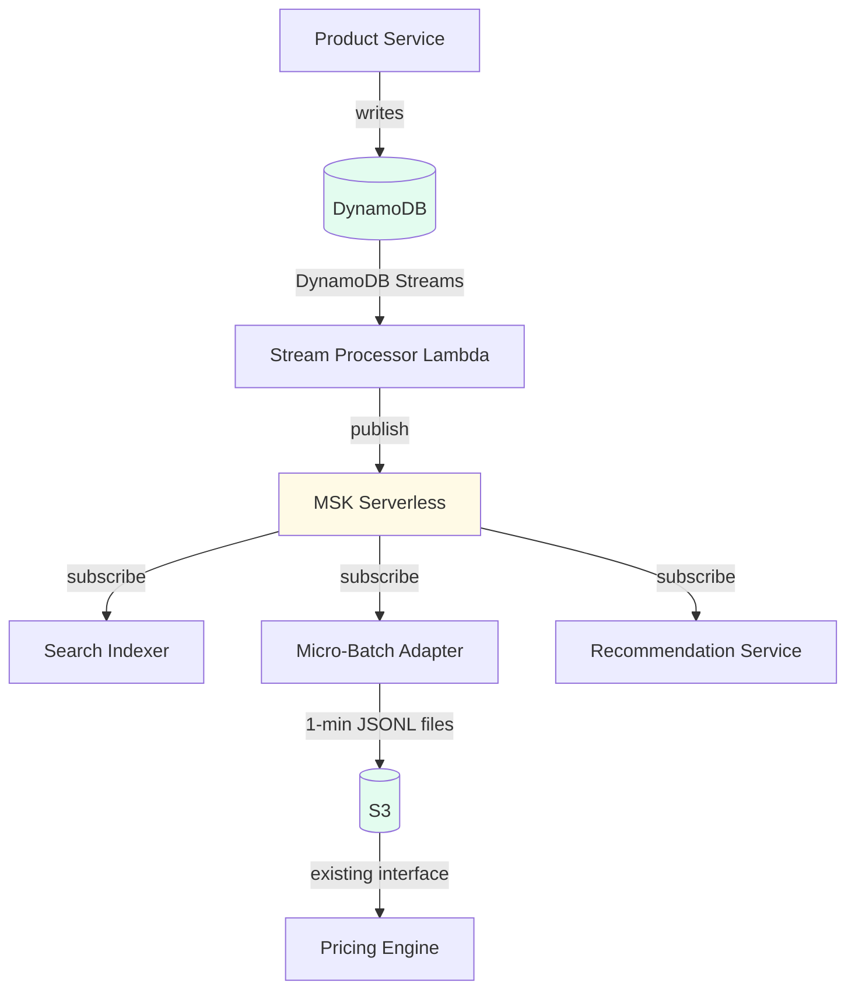

# Example: Solution Options Document

This is a fully annotated example showing how to apply the skill. Annotations are in HTML comments. The example is fictional but structurally representative of the highest-scoring decision documents from the observed Confluence decision log. It demonstrates: open questions that frame the decision, scenario walkthroughs, multiple assessment tables, complex cells with emoticon-style pros/cons, gap analysis, conditional recommendations, collapsible supplemental sections, and first-person voice with inline reasoning.

---

<!-- STATUS HEADER: Small 2-cell table. In Confluence, the status cell gets a colored background. Append the decision outcome to the status when resolved. -->

| Status | **Approved - Option 2 (with Option 3 as fast-follow)** |
|--------|-------------------------------------------------------|

<!-- PROBLEM STATEMENT: Lead with the immediate issue. No sub-labels needed. State current state as tight bullets. -->

## Problem Statement

The product catalog sync pipeline drops ~1.2% of updates during peak seasonal loads, causing stale storefront data for 4-12 hours until nightly reconciliation. The pipeline was designed for a single-region storefront (~50K products) and cannot keep pace with 3 regions / 380K products. Under load, the 15-minute batch window's staging table accumulates faster than the writer drains it; stragglers are silently overwritten by the next batch ("last batch wins"), and downstream consumers that need intermediate states miss the transitions.

**Current state:**

- Batch pipeline: 15-minute windows, 8K-25K updates/window (peak: 40K)
- Read store: DynamoDB single-table design, ~12M items
- Downstream consumers: search indexer (Elasticsearch), pricing engine (PostgreSQL), recommendation service (Redis)
- Nightly reconciliation at 02:00 UTC (~90 min)
- No visibility into dropped updates until reconciliation detects drift

<!-- OPEN QUESTIONS: Place BEFORE the assessment when answers determine which options are viable. -->

## Open Questions

| # | Question | Context | Answer |
|---|---|---|---|
| Q1 | Must we keep the batch-write interface for pricing? | Pricing ingestion only accepts JSONL on S3. Can't change until their Q3 refactor. | **(check)** Yes. Micro-batching adapter needed for ~6 months. |
| Q2 | Is the DynamoDB single-table design negotiable? | Product API and admin dashboard read directly from it. | **(check)** No. Can add secondary stores but cannot replace DynamoDB. |
| Q3 | Budget for managed streaming (Kafka, Kinesis)? | Self-hosted Kafka failed reliability review last year. | **(?)** Pending finance approval. ~$2,800/mo for MSK Serverless. *Review scheduled 2025-12-01.* |
| Q4 | Can recommendations tolerate 5-min eventual consistency? | If yes, doesn't need the real-time path. | **(check)** Yes. Confirmed with ML team. |

## Constraints and Key Considerations

| Consideration | Priority | Description |
|---|---|---|
| Zero dropped updates | Highest | Every product change must reach every consumer. Silent data loss is unacceptable. |
| Storefront latency | Highest | Updates visible on storefront within 60s of source commit |
| Pricing engine compatibility | High | Batch-compatible interface required for ~6 months (Q1) |
| DynamoDB retention | High | Cannot replace primary read store (Q2) |
| Cost | Medium | Total solution under $8K/mo incremental |
| Operational complexity | Medium | Team of 4, no dedicated SRE; must be observable without custom tooling |
| Migration risk | Medium | Must support parallel-run during transition |

<!-- SCENARIOS: Edge cases that stress-test each option. Reference by number in the assessment. -->

## Scenarios

| # | Scenario | Discussion |
|---|---|---|
| S1 | **Given**: Seasonal load pushes 40K updates in 10 min while mid-batch. **Then**: No updates lost; storefront reflects all changes within 60s of load completing. | This is the failure mode causing 1.2% loss today. |
| S2 | **Given**: Pricing engine down for planned 2-hour maintenance. **Then**: Price changes delivered on recovery, in order, no manual intervention. | Today we re-run nightly reconciliation — 90-min delay after recovery. |
| S3 | **Given**: Product created, updated 3x, soft-deleted within one 15-min window. **Then**: Pricing engine gets all intermediate states (audit). Search/recs need only final state. | Batch pipeline today delivers final state only. |
| S4 | **Given**: Old and new pipelines running in parallel during migration. **Then**: Read store resolves to correct (latest) state without corruption. | Need idempotent writes or conflict-resolution strategy. |

## Options Assessment

> *Scoring is absolute against the constraints. Two options can both score green on the same criterion.*

| Criteria | Option 1: Optimized Batch | Option 2: CDC with Event Stream | Option 3: Full Event Sourcing |
|---|---|---|---|
| Option Description | Reduce batch window to 2 min. Add overflow queue for peaks. Keep bulk-write architecture. | DynamoDB Streams → managed event stream (Kinesis or MSK). Consumers subscribe independently. DynamoDB remains primary store. | Replace write path with event store. DynamoDB populated as read projection. All consumers derive state from event log. |
| Zero dropped updates | **[~]** Overflow queue prevents silent loss but can itself back up under extreme load. Needs DLQ + alerting + manual redrive. | **[+]** DynamoDB Streams: at-least-once, 24-hour retention. Event stream: 7-30 day configurable. Lost events structurally impossible. | **[+]** Events are system of record. Loss requires event store failure (mitigated by replication). |
| Storefront latency | **[~]** 2-min batches → ~2-min average. Hits 60s target only at 30-sec micro-batches, which stresses the writer. | **[+]** Streams trigger within seconds. Prototype: 3-8s end-to-end. | **[+]** Same as Option 2 for read projection. ~1-2s additional for event commit. Still well within 60s. |
| Pricing engine compat | **[+]** No change. Continues consuming batch files from S3. | **[~]** Needs micro-batching adapter: events → 1-min JSONL windows → S3. **M** to build. *Not green because it's new code in the critical pricing path.* | **[~]** Same adapter as Option 2, plus pricing eventually needs event-sourced payloads. |
| DynamoDB retention | **[+]** No change. | **[+]** DynamoDB remains primary. Streams is a built-in feature. | **[-]** DynamoDB becomes read projection. Write path changes fundamentally. Risk of subtle behavioral differences for product API / admin dashboard. |
| Cost | **[+]** ~$200/mo (overflow SQS + higher WCU). | **[~]** ~$3,200/mo (MSK Serverless + adapter Lambda). Within budget but uses most of $8K ceiling. *Pending Q3 finance.* | **[-]** ~$5,200/mo for EventStoreDB cluster + all Option 2 costs. Exceeds $8K ceiling. |
| Operational complexity | **[+]** Familiar architecture. Overflow queue + DLQ is well-understood. | **[~]** **(+)** DynamoDB Streams + Lambda well-supported by AWS tooling **(-)** MSK Serverless newer; team has no Kafka ops experience **(i)** CloudWatch covers most observability out of the box | **[-]** **(-)** Event store is new operational dependency **(-)** Read projections add rebuild/replay complexity **(-)** Zero team experience with event sourcing patterns |
| Migration risk | **[+]** Trivial parallel-run: run both 15-min and 2-min batches, compare output. | **[+]** Keep existing batch alongside CDC stream. Both write to DynamoDB; conditional writes resolve conflicts. **(i)** DynamoDB conditional writes handle S4 naturally. | **[-]** Write path itself changes. Dual-write proxy needed during migration. |

## Scenario Walkthroughs

| Scenario | Optimized Batch (Opt 1) | CDC with Event Stream (Opt 2) | Full Event Sourcing (Opt 3) |
|---|---|---|---|
| S1 (seasonal peak) | Overflow queue absorbs burst. Writer drains at own pace. Worst case ~5 min latency during peak. | Streams processes each write individually. No batching bottleneck. Consumers auto-scale with shard count. | Same throughput as Opt 2. Event store needs capacity planning for peak write TPS. |
| S2 (pricing downtime) | Batch files accumulate on S3. Pricing processes backlog on recovery. Works today, continues to work. | Adapter writes to S3 on schedule. Files accumulate during outage. Same recovery but 1-min granularity. | Same as Opt 2. |
| S3 (intermediate states) | ~~Still lost. Batch delivers final state only.~~ **(x)** DOES NOT SOLVE S3. | **(check)** Streams delivers every change as separate event. Pricing gets all intermediate states via adapter. | **(check)** All intermediate states preserved by definition. |
| S4 (parallel-run) | Compare batch output between old/new windows. Straightforward diff. | Both pipelines write to DynamoDB. Conditional writes (version attribute) ensure latest-wins. | Dual-write proxy required. Significantly more complex. |

## Option Details

> ~~**Option 4: Replace DynamoDB with PostgreSQL + logical replication** — per Q2, product API and admin dashboard depend on current DynamoDB schema. Out of scope.~~

### Option 2: CDC with Event Stream

**Implementation steps:**

1. Enable DynamoDB Streams (NEW_AND_OLD_IMAGES)
2. Deploy stream processor Lambda (DDB records → domain events)
3. Stand up MSK Serverless with topic-per-entity partitioning
4. Deploy micro-batching adapter (Lambda + S3) for pricing
5. Migrate search indexer to MSK (parallel-run w/ existing batch, 2 weeks)
6. Migrate recommendation service last (tolerates 5-min staleness per Q4)
7. Decommission batch pipeline after 4-week zero-drift observation

**Effort:** **L** (3 sprints) — MSK setup and micro-batching adapter are the long poles.

Click to expand: Micro-Batch Adapter Design Notes

Adapter accumulates MSK events into 1-minute windows, groups by product, writes JSONL to S3 in pricing's expected format.

- Window: 1 minute. Pricing confirmed acceptable.
- Late arrivals: go into next window. Pricing handles out-of-order via its own versioning.
- Failure: uncommitted events replay from MSK (consumer offset not committed until S3 write succeeds).

We considered writing directly to pricing's SQS queue, but their team specifically asked for S3 — their ingestion job is scheduled, not event-driven. Revisit when they refactor in Q3.

## Gap Analysis

| Gap | Risk | Mitigation SWAG |
|---|---|---|
| No alerting for stream processing lag | Lambda falls behind silently; storefront goes stale without notice. | **S** — CloudWatch alarm on IteratorAge (threshold: 30s) → PagerDuty. |
| MSK Serverless: no multi-region replication | us-east-1 outage stalls event consumers in us-west-2. DynamoDB global tables cover the read path. | **L** — Cross-region MSK or Kinesis secondary. *Not blocking for launch.* |
| Micro-batch adapter is new code on critical path | Bug could corrupt pricing data. | **S** — Integration tests comparing adapter output against known-good batch file. In CI. |
| No replay capability for search indexer | If search index corrupts, can't rebuild from MSK (7-day retention). | **M** — "Full snapshot" mode on stream processor: reads entire DynamoDB table, publishes synthetic events. Doubles as DR tool. |

## Recommendation

- **If finance approves MSK budget** (by 2025-12-01): proceed with Option 2 as described. Target go-live Sprint 25.3.
- **If not approved**: fall back to Kinesis Data Streams (~40% cheaper, lower throughput ceiling). Revisit if volume exceeds shard limits.
- ~~Option 1 not recommended — does not solve S3 (intermediate state preservation), which is a hard requirement from pricing audit.~~

Option 3 is the better long-term architecture but exceeds budget, requires skills we don't have, and the migration is hard to de-risk with a parallel-run. Revisit in 6-9 months.

## Decision Summary

**Option 2 approved** at the 2025-11-20 architecture review (Kinesis as fallback if MSK not approved by 2025-12-01). Participants: Alice, Bob, Carol, Dave.

Option 3 acknowledged as strategic direction. EventStoreDB spike planned for Q2 FY26.

## Next Steps

- [ ] @alice: Enable DynamoDB Streams on staging table + prototype stream processor Lambda by 2025-11-29
- [ ] @bob: Draft MSK Serverless capacity estimate for finance review by 2025-11-27
- [ ] @carol: Build micro-batch adapter prototype, validate against existing batch files by 2025-12-06
- [x] @dave: Confirm pricing engine S3 format — **Done** (JSONL, one file/minute, partitioned by date)
- [ ] Team: Decision checkpoint on MSK vs. Kinesis after finance review (2025-12-01)

Click to expand: Supplemental — Slack thread with pricing team (2025-11-18)

> **dave**: Quick question — if we move to 1-minute batches instead of 15-minute, does your ingestion job handle that?
>
> **pricing-lead**: Yeah, the job polls S3 every 2 minutes anyway. More files = more iterations but no code changes on our end.
>
> **dave**: And you definitely need the intermediate price states, not just the final?
>
> **pricing-lead**: Absolutely. Audit requires every price change with timestamp. If a product goes $100 → $80 → $90 in one window, we need all three states.
>
> **dave**: Got it. That rules out the optimized-batch approach for us then. We'll go with CDC.

